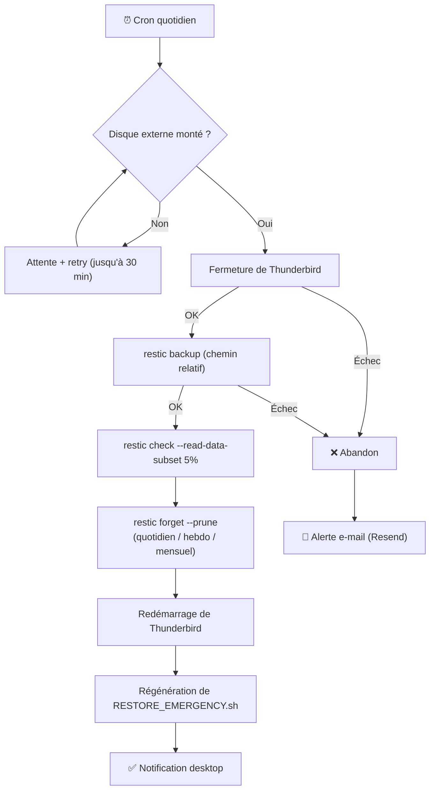
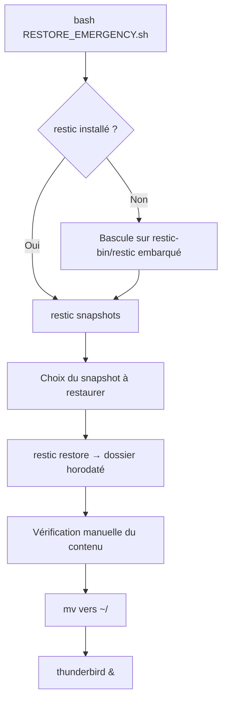

# Thunderbird Backup Guardian

*[🇬🇧 Read in English](README.md)*

**Sauvegarde chiffrée, automatisée et vérifiée du profil Thunderbird.**

Chiffrement AES-256 réel (restic) · déduplication · vérification d'intégrité · rétention quotidien/hebdomadaire/mensuel · restauration autonome (fonctionne même sans internet ni `restic` préinstallé) · notifications desktop + e-mail sur échec.


---

## Sommaire

- [Fonctionnalités](#fonctionnalités)
- [Architecture](#architecture)
- [Prérequis](#prérequis)
- [Installation](#installation)
- [Structure du projet](#structure-du-projet)
- [Déploiement en production](#déploiement-en-production)
- [Configuration](#configuration)
- [Utilisation quotidienne](#utilisation-quotidienne)
- [Sécurité](#sécurité)
- [🆘 Restauration](#-restauration--guide-détaillé)
- [Dépannage](#dépannage)
- [FAQ](#faq)
- [Historique](#historique)

---

## Fonctionnalités

| | |
|---|---|
| 🔐 **Chiffrement réel** | AES-256 via restic — pas un mot de passe décoratif ignoré à l'écriture (voir [Historique](#historique)) |
| ♻️ **Déduplication** | Seuls les blocs nouveaux/modifiés sont stockés — sauvegardes incrémentales rapides après la première |
| ✅ **Intégrité vérifiée** | Échantillonnage de données à chaque run + vérification complète à la demande (`--verify`) |
| 🗓️ **Rétention fine** | Quotidien / hebdomadaire / mensuel configurables, purge automatique (`restic forget --prune`) |
| 🔁 **Résilient au montage tardif** | Réessaie automatiquement si le disque externe n'est pas encore monté à l'heure du cron |
| 🆘 **Restauration autonome** | Script de restauration auto-régénéré, fonctionne même sans `restic` installé (binaire statique embarqué) ni accès internet |
| 🔔 **Notifications** | Desktop (`notify-send`) à chaque run, e-mail (Resend) en cas d'échec |
| 🧩 **Zéro donnée personnelle codée en dur** | Aucun chemin absolu ni nom d'utilisateur enregistré dans le dépôt ou les scripts générés |

---

## Architecture

### Flux de sauvegarde



### Flux de restauration



---

## Prérequis

- Linux (testé sur Kubuntu), paquets système `restic` et `thunderbird`
- Python 3.10+
- Un compte [Resend](https://resend.com/) (gratuit) si tu veux les alertes e-mail
- Un disque externe (ou tout point de montage) pour héberger le dépôt chiffré

---

## Installation

```bash
cd ~/PycharmProjects/Backup-Thunderbird

# Dépendances système
sudo apt install restic thunderbird

# Environnement virtuel Python
python3 -m venv .venv
.venv/bin/pip install -r requirements.txt

# Configuration des alertes e-mail (optionnel)
cp .env.example .env
nano .env   # RESEND_API_KEY, EMAIL_FROM, EMAIL_TO
```

---

## Structure du projet

```
~/PycharmProjects/Backup-Thunderbird/
│
├── thunderbird_guardian.py         ← Script principal
├── requirements.txt                ← Dépendances Python (venv)
├── .venv/                          ← Environnement virtuel (non versionné)
├── .env                            ← Secrets (clé Resend, adresse e-mail — non versionné)
├── .env.example                    ← Modèle de .env, sans secret
├── README.md / README.fr.md        ← Ce fichier (EN / FR)
├── DISASTER_RECOVERY.md / .fr.md   ← Procédures de restauration, tous scénarios (EN / FR)
└── DIRECTORY_CONFIGURATION.md      ← Détail de la résolution du répertoire de destination
```

Sur le disque de sauvegarde lui-même (synchronisé automatiquement à chaque run) :
```
Backup Thunderbird/
├── restic-repo/                    ← Dépôt chiffré (données + métadonnées restic)
├── restic-bin/restic               ← Binaire restic statique embarqué (secours hors-ligne)
├── RESTORE_EMERGENCY.sh / .fr.sh   ← Régénéré à chaque sauvegarde réussie (EN / FR)
├── README.md / README.fr.md          ┐ Doc de restauration, lisible directement
├── DISASTER_RECOVERY.md / .fr.md     ┘ depuis le disque, sans PC ni internet
└── guardian_automated.log          ← Log applicatif (rotation automatique, 10 Mo x5)
```

---

## Déploiement en production

Suivre ces étapes dans l'ordre pour passer d'une installation locale à un
système entièrement autonome.

**1. Initialiser le mot de passe de chiffrement**
```bash
.venv/bin/python3 thunderbird_guardian.py --init
```

**2. Mettre le mot de passe à l'abri d'un crash de ce PC — étape non-optionnelle**
Ce mot de passe ne vit que dans le trousseau système de cette machine. Sans
copie externe (Proton Pass, autre gestionnaire de mots de passe, copie
papier), une panne de ce PC rend le dépôt chiffré définitivement
illisible — voir [Sécurité](#sécurité).

**3. Premier run manuel, pour valider avant d'automatiser**
```bash
.venv/bin/python3 thunderbird_guardian.py
```
Vérifie que : Thunderbird se ferme et redémarre correctement, l'archive
`restic-repo` est créée sur le disque, `RESTORE_EMERGENCY.sh` est généré,
et que la notification desktop s'affiche.

**4. Embarquer le binaire restic statique sur le disque (résilience hors-ligne)**
```bash
DEST="/chemin/vers/Backup Thunderbird/restic-bin"
mkdir -p "$DEST"
API=$(curl -s https://api.github.com/repos/restic/restic/releases/latest)
BIN_URL=$(echo "$API" | grep browser_download_url | grep "linux_amd64.bz2" | cut -d '"' -f4)
SUMS_URL=$(echo "$API" | grep browser_download_url | grep '"SHA256SUMS"' | cut -d '"' -f4)
curl -sL -o /tmp/restic.bz2 "$BIN_URL"
curl -sL -o /tmp/SHA256SUMS "$SUMS_URL"
[ "$(grep linux_amd64.bz2 /tmp/SHA256SUMS | awk '{print $1}')" = "$(sha256sum /tmp/restic.bz2 | awk '{print $1}')" ] && echo "✅ checksum OK" || echo "❌ NE PAS UTILISER"
bunzip2 -c /tmp/restic.bz2 > "$DEST/restic" && chmod +x "$DEST/restic"
```
Permet à `RESTORE_EMERGENCY.sh` de fonctionner même si `restic` n'est plus
installable (pas d'internet, dépôt de paquets indisponible) sur la machine
de secours.

**5. Tester une restauration au moins une fois**
```bash
bash "/chemin/vers/Backup Thunderbird/RESTORE_EMERGENCY.sh"
```
Un système de sauvegarde jamais restauré n'est qu'une hypothèse — voir
[Restauration](#-restauration--guide-détaillé).

**6. Automatiser via cron**
```bash
crontab -e
```
```
40 18 * * * export $(systemctl --user show-environment | grep -E '^(DISPLAY|WAYLAND_DISPLAY|XAUTHORITY|DBUS_SESSION_BUS_ADDRESS)=') && cd ~/PycharmProjects/Backup-Thunderbird && .venv/bin/python3 thunderbird_guardian.py
```
`DISPLAY`/`DBUS_SESSION_BUS_ADDRESS` sont nécessaires pour que
`notify-send` fonctionne depuis un cron (pas de session graphique attachée
par défaut), et `XAUTHORITY` est nécessaire pour que Thunderbird lui-même
puisse se reconnecter à l'affichage lors de son redémarrage après la
sauvegarde. Coder en dur `DISPLAY=:0` sans `XAUTHORITY` peut fonctionner
sur certaines configurations mais échoue silencieusement sous
Wayland/XWayland, où le vrai fichier d'autorisation X11 se trouve à un
chemin aléatoire (`/run/user/<uid>/xauth_XXXXXX`) plutôt qu'au
`~/.Xauthority` par défaut — Thunderbird est bien lancé, échoue aussitôt à
se connecter à l'affichage, puis se termine, sans que le script ne puisse
le détecter avec un simple appel `Popen()`. Lire les valeurs en direct via
`systemctl --user show-environment` évite de coder en dur un chemin qui
change à chaque connexion.

**7. Valider le premier run automatique**
Vérifie le lendemain : notification reçue (desktop et/ou e-mail selon le
résultat), `guardian_automated.log` à jour sur le disque, nouvelle
sauvegarde présente (`restic snapshots`).

---

## Configuration

| Variable | Défaut | Description |
|----------|--------|--------------|
| `TB_BACKUP_DIR` | `~/thunderbird_backups` | Répertoire de destination (aucune auto-détection de disque) |
| `TB_SOURCE_DIR` | `~/.thunderbird` | Répertoire source |
| `TB_KEEP_DAILY` | `7` | Sauvegardes quotidiennes conservées |
| `TB_KEEP_WEEKLY` | `4` | Sauvegardes hebdomadaires conservées |
| `TB_KEEP_MONTHLY` | `6` | Sauvegardes mensuelles conservées |
| `TB_MOUNT_RETRY_ATTEMPTS` | `6` | Tentatives d'attente du disque |
| `TB_MOUNT_RETRY_DELAY` | `300` | Secondes entre deux tentatives |
| `TB_LOG_LEVEL` | `INFO` | Verbosité (DEBUG/INFO/WARNING/ERROR) |

Dans `.env` (jamais versionné — voir `.env.example`) :

| Variable | Description |
|----------|--------------|
| `RESEND_API_KEY` | Clé API Resend pour l'envoi d'alertes e-mail |
| `EMAIL_FROM` | Adresse expéditrice (ex : `onboarding@resend.dev`) |
| `EMAIL_FROM_NAME` | Nom affiché de l'expéditeur |
| `EMAIL_TO` | Adresse destinataire des alertes d'échec |

Détail de la résolution du répertoire de destination :
[DIRECTORY_CONFIGURATION.md](DIRECTORY_CONFIGURATION.md).

---

## Utilisation quotidienne

```bash
# Sauvegarde manuelle
.venv/bin/python3 thunderbird_guardian.py

# Vérification complète du dépôt (lent, relit chaque bloc)
.venv/bin/python3 thunderbird_guardian.py --verify

# Lister les sauvegardes disponibles
export RESTIC_PASSWORD="$(.venv/bin/python3 -c "import keyring; print(keyring.get_password('thunderbird_backup_guardian','encryption_password'))")"
restic -r "/chemin/vers/Backup Thunderbird/restic-repo" snapshots
```

---

## Sécurité

- **Chiffrement** : AES-256 via restic, appliqué réellement à l'écriture
  (contrairement à l'ancienne version — voir [Historique](#historique)).
- **Mot de passe** : stocké dans le trousseau système (`keyring`), jamais
  en dur dans le code ni dans un fichier versionné. Injecté au processus
  `restic` uniquement via variable d'environnement, jamais loggé.
- **Aucune donnée personnelle codée en dur** : la sauvegarde utilise un
  chemin relatif (`cwd` sur le dossier parent), donc restic n'enregistre
  jamais de chemin absolu ni de nom d'utilisateur — ni dans le dépôt, ni
  dans `RESTORE_EMERGENCY.sh` généré. Vérifié en exécution réelle.
- **Binaire restic embarqué vérifié** : le binaire statique de secours est
  téléchargé depuis les releases officielles GitHub et comparé à son
  SHA256 publié avant tout usage.
- **Point de défaillance unique assumé** : ce mot de passe est la seule
  clé du dépôt. Il doit être stocké indépendamment de cette machine
  (gestionnaire de mots de passe synchronisé type Proton Pass/Bitwarden,
  ou copie papier) — sans quoi une panne de ce PC rend la sauvegarde
  définitivement illisible. Ce n'est pas un défaut du script : c'est le
  prix d'un chiffrement qui protège vraiment.

---

## 🆘 RESTAURATION — Guide détaillé

### Principe de sécurité

**Rien n'est jamais écrasé automatiquement.** La restauration écrit toujours
dans un dossier neuf et horodaté (`~/<profile>-restored-<date>`, où
`<profile>` est le nom de ton dossier de profil Thunderbird — `.thunderbird`
par défaut, sauf si tu as personnalisé `TB_SOURCE_DIR`), jamais
directement sur ton profil actif. Tu vérifies le résultat, puis c'est toi
qui bascules manuellement en une commande `mv`. Si quelque chose se passe
mal, ton ancien profil (ou l'absence de profil) n'a pas bougé.

### Étape par étape

**1. Localiser le disque de sauvegarde et le script**

Sur le disque externe, dans le dossier `Backup Thunderbird`, tu trouveras :
```
Backup Thunderbird/
├── restic-repo/           ← les données chiffrées elles-mêmes
├── restic-bin/restic      ← copie de secours du binaire restic (hors-ligne)
└── RESTORE_EMERGENCY.sh   ← le script à lancer, régénéré à chaque sauvegarde
```

**2. Lancer le script**
```bash
cd "/chemin/vers/Backup Thunderbird"
bash RESTORE_EMERGENCY.sh
```

**3. Ce qui se passe, dans l'ordre**

- Le script vérifie si `restic` est installé sur la machine. Sinon, il
  bascule automatiquement sur `restic-bin/restic` embarqué sur le disque —
  aucune action de ta part, aucun besoin d'internet à ce stade.
- Il te demande le **mot de passe du dépôt restic** (celui défini à
  `--init`, retrouvable dans Proton Pass/ton gestionnaire de mots de passe
  si ce PC n'existe plus — voir FAQ).
- Il affiche la liste des sauvegardes disponibles (`restic snapshots`),
  avec leur date.
- Il te demande quel snapshot restaurer (Entrée = le plus récent).
- Il restaure dans `~/<profile>-restored-<date>` et t'indique le chemin
  exact où se trouve le profil restauré une fois l'opération terminée.

**4. Vérifier avant de basculer**

Regarde dans le dossier indiqué que le contenu a l'air complet (taille
cohérente, dossiers de mails présents) avant de continuer.

**5. Activer le profil restauré**

Le script affiche lui-même les commandes exactes à copier-coller à la fin,
adaptées à ton `$HOME` réel et au nom exact de ton dossier de profil. Dans
les grandes lignes :
```bash
pkill -x thunderbird 2>/dev/null || true
mv ~/<profile> ~/<profile>.old_<date>       # garde l'actif de côté, au cas où
mv ~/<profile>-restored-<date>/<profile> ~/<profile>
thunderbird &
```

### Restaurer seulement un dossier ou un e-mail précis

Pas besoin de tout restaurer pour récupérer un seul élément :
```bash
export RESTIC_PASSWORD='ton_mot_de_passe'
restic -r "/chemin/vers/Backup Thunderbird/restic-repo" \
  restore latest --target /tmp/restauration_partielle \
  --include "*NomDuDossier*"
```
Ou explorer le contenu sans rien extraire (montage en lecture seule) :
```bash
mkdir -p /tmp/tb-browse
restic -r "/chemin/vers/Backup Thunderbird/restic-repo" mount /tmp/tb-browse
```

### Scénario catastrophe (PC mort, OS réinstallé, autre machine)

Le principe reste identique — brancher le disque, lancer
`RESTORE_EMERGENCY.sh` — mais quelques points changent (localisation du
point de montage, installation de `restic`/`thunderbird`, récupération du
mot de passe). Détail complet, scénario par scénario, dans
**[DISASTER_RECOVERY.fr.md](DISASTER_RECOVERY.fr.md)**.

---

## Dépannage

**`❌ ERREUR: module 'X' manquant`**
Le script n'est pas lancé avec l'interpréteur du venv :
```bash
.venv/bin/python3 thunderbird_guardian.py   # et pas: python3 thunderbird_guardian.py
```

**`❌ Dépendances système manquantes : restic`**
```bash
sudo apt install restic
```

**`❌ Mot de passe non initialisé`**
```bash
.venv/bin/python3 thunderbird_guardian.py --init
```

**Le disque n'est jamais détecté**
```bash
export TB_LOG_LEVEL=DEBUG
.venv/bin/python3 thunderbird_guardian.py
```
Vérifie le point de montage réel (`/media/$USER/...` vs `/run/media/$USER/...`
selon l'environnement de bureau) et ajuste `TB_BACKUP_DIR` si besoin — voir
[DIRECTORY_CONFIGURATION.md](DIRECTORY_CONFIGURATION.md).

**Le script ne s'exécute pas en CRON**
```bash
grep CRON /var/log/syslog | tail -20
crontab -l
```

---

## FAQ

**J'ai oublié le mot de passe du dépôt restic. Y a-t-il un moyen de contourner ça ?**
Non. C'est un vrai chiffrement AES-256, pas de porte dérobée — c'est le prix
d'une protection réelle (l'ancienne version du script *croyait* chiffrer
mais ne le faisait pas du tout, ce n'est plus le cas). Le mot de passe doit
être conservé quelque part d'indépendant de ce PC (Proton Pass, autre
gestionnaire de mots de passe, copie papier). Sans lui, le dépôt est
définitivement illisible.

**La restauration va-t-elle écraser mes e-mails actuels ?**
Non, jamais automatiquement. Elle restaure toujours dans un nouveau dossier
horodaté. C'est toi qui décides, ensuite, de remplacer ton profil actif —
et le script te propose même de sauvegarder l'ancien profil à côté
(`.thunderbird.old_<date>`) avant de le remplacer.

**Le disque externe ne se monte plus au même endroit qu'avant, ça pose problème ?**
Non. `RESTORE_EMERGENCY.sh` se situe toujours à la racine du disque et
calcule son propre emplacement dynamiquement (`SCRIPT_DIR`) — peu importe
où le disque est monté, tant que tu lances le script depuis ce dossier.

**Je restaure sur un autre PC, ou avec un nom d'utilisateur Linux différent, est-ce que ça marche ?**
Oui. Tout repose sur `$HOME` (résolu dynamiquement au moment de
l'exécution) et sur le disque externe — rien ne dépend du nom de la
machine ou de l'utilisateur d'origine. La sauvegarde elle-même ne contient
aucun chemin absolu ni nom d'utilisateur (voir [Sécurité](#sécurité)).

**`restic` n'est pas installé sur la machine de secours, et je n'ai pas internet.**
Utilise le binaire embarqué sur le disque (`restic-bin/restic`) —
`RESTORE_EMERGENCY.sh` bascule dessus automatiquement, sans action de ta
part. Si ce binaire a lui-même disparu et que tu as internet, voir la
procédure de téléchargement avec vérification de checksum dans
[DISASTER_RECOVERY.fr.md](DISASTER_RECOVERY.fr.md#scénario-3--restic-introuvable-et-le-binaire-embarqué-a-disparuest-corrompu).

**Est-ce que je dois installer Thunderbird avant de restaurer ?**
Non. Seul `restic` (ou son binaire embarqué) est nécessaire pour restaurer
les données — Thunderbird n'intervient qu'à la toute dernière étape, pour
rouvrir le profil une fois restauré. L'ordre d'installation n'a aucune
importance technique.

**Comment je sais quelle sauvegarde restaurer si je veux revenir à une date précise (pas la plus récente) ?**
`RESTORE_EMERGENCY.sh` affiche la liste complète des sauvegardes disponibles
avec leur date avant de te demander laquelle choisir. Tu peux aussi lister
manuellement : `restic -r "<repo>" snapshots`.

**Comment vérifier qu'une sauvegarde n'est pas corrompue avant de m'en servir ?**
```bash
.venv/bin/python3 thunderbird_guardian.py --verify
```
Lance un contrôle complet (`restic check --read-data`) — plus lent qu'une
vérification courante, mais qui relit vraiment chaque bloc de données.

**Le disque de sauvegarde lui-même montre des signes de faiblesse (erreurs, lenteurs).**
Ne lance aucune écriture dessus (ni sauvegarde, ni restauration). Fais
d'abord une image bit-à-bit sur un support sain (`ddrescue`), puis travaille
sur la copie. Détail dans [DISASTER_RECOVERY.fr.md](DISASTER_RECOVERY.fr.md#scénario-4--le-disque-de-sauvegarde-montre-des-signes-de-défaillance).

**Ce script de restauration a-t-il vraiment été testé, ou juste écrit ?**
Testé deux fois, en exécution réelle, pas seulement relu. D'abord sur un
dépôt restic jetable avec des données de test synthétiques, restauré de
bout en bout via `RESTORE_EMERGENCY.sh`, avec comparaison bit-à-bit
(`diff -r`) confirmant l'identité parfaite — à la fois avec `restic`
système et avec le binaire embarqué en secours (PATH sans `restic` simulé
explicitement). Deux bugs réels trouvés et corrigés lors de cette passe :
un chemin de restauration incorrect, et un nom d'utilisateur codé en dur
qui se serait retrouvé dans le dépôt et les scripts générés. Ensuite, sur
un vrai profil Thunderbird de production (14 Go) : sauvegarde complète en
3min34, restauration complète en 2min39, `diff -r` contre le profil actif
ne montrant que les différences attendues du fait que Thunderbird tournait
en direct pendant le test (fichiers d'index mail, telemetry) — aucune
perte de données. Cette passe a trouvé un troisième bug réel : un fichier
`.parentlock` résiduel, jamais nettoyé avant sauvegarde, qui pouvait
déclencher un faux "déjà en cours d'exécution" sur la copie restaurée
(corrigé depuis — voir [Historique](#historique) et
[DISASTER_RECOVERY.fr.md](DISASTER_RECOVERY.fr.md#scénario-6--thunderbird-dit-déjà-en-cours-dexécution-sur-le-profil-restauré)).

---

## Historique

**v22 (actuelle) — migration vers restic.** La v21 utilisait
`zipfile.ZipFile.setpassword()` pour "chiffrer" les archives — une
limitation connue du module standard Python qui **ignore silencieusement
le mot de passe à l'écriture**. Toutes les sauvegardes produites par la
v21 étaient donc en clair, malgré la documentation annonçant un
chiffrement AES-256. La v22 remplace entièrement ce mécanisme par restic
(chiffrement réel, déduplication, vérification d'intégrité native), corrige
un bug de répertoire de destination codé en dur, et ajoute la détection
d'échec (le script tournait avec ~50 % d'échecs silencieux sur 6 mois,
faute d'alerte), la résilience au montage tardif du disque, et une
restauration entièrement autonome et testée en conditions réelles.

---

*Né d'un besoin personnel (et d'une découverte peu agréable — voir*
*[Historique](#historique)*
*) — partagé sous licence MIT pour quiconque cherche une sauvegarde*
*Thunderbird réellement chiffrée, pas juste en apparence.*
