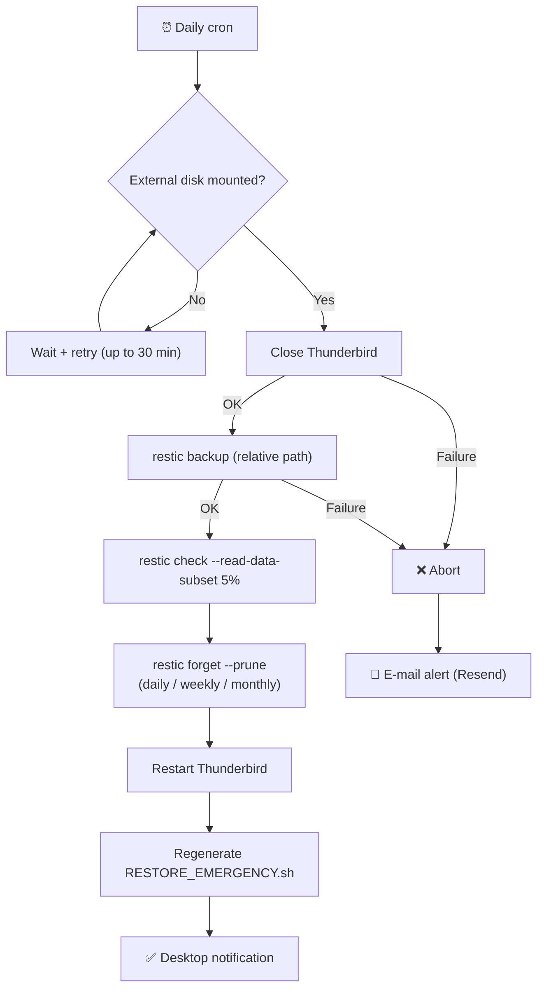
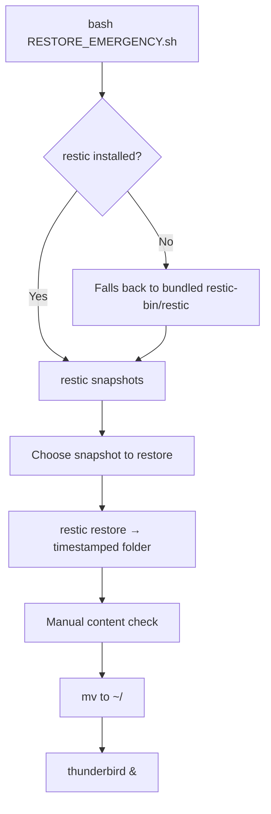

# Thunderbird Backup Guardian

*[🇫🇷 Lire en français](README.fr.md)*

**Encrypted, automated, verified backups for your Thunderbird profile.**

Real AES-256 encryption (restic) · deduplication · integrity checking · daily/weekly/monthly retention · self-contained restore (works even without internet or `restic` preinstalled) · desktop + e-mail notifications on failure.


---

## Table of contents

- [Features](#features)
- [Architecture](#architecture)
- [Requirements](#requirements)
- [Installation](#installation)
- [Project structure](#project-structure)
- [Deploying to production](#deploying-to-production)
- [Configuration](#configuration)
- [Daily usage](#daily-usage)
- [Security](#security)
- [🆘 Restore guide](#-restore-guide)
- [Troubleshooting](#troubleshooting)
- [FAQ](#faq)
- [History](#history)

---

## Features

| | |
|---|---|
| 🔐 **Real encryption** | AES-256 via restic — not a decorative password silently ignored on write (see [History](#history)) |
| ♻️ **Deduplication** | Only new/changed blocks are stored — fast incremental backups after the first one |
| ✅ **Verified integrity** | Data sampling on every run + full check on demand (`--verify`) |
| 🗓️ **Fine-grained retention** | Configurable daily / weekly / monthly, automatic pruning (`restic forget --prune`) |
| 🔁 **Resilient to late mounting** | Automatically retries if the external disk isn't mounted yet at cron time |
| 🆘 **Self-contained restore** | Auto-regenerated restore script, works even without `restic` installed (bundled static binary) or internet access |
| 🔔 **Notifications** | Desktop (`notify-send`) on every run, e-mail (Resend) on failure |
| 🧩 **Zero hardcoded personal data** | No absolute path or username stored in the repository or generated scripts |

---

## Architecture

### Backup flow



### Restore flow



---

## Requirements

- Linux (tested on Kubuntu), `restic` and `thunderbird` system packages
- Python 3.10+
- A [Resend](https://resend.com/) account (free tier works) if you want e-mail alerts
- An external disk (or any mount point) to host the encrypted repository

---

## Installation

```bash
cd ~/PycharmProjects/Backup-Thunderbird

# System dependencies
sudo apt install restic thunderbird

# Python virtual environment
python3 -m venv .venv
.venv/bin/pip install -r requirements.txt

# E-mail alerts setup (optional)
cp .env.example .env
nano .env   # RESEND_API_KEY, EMAIL_FROM, EMAIL_TO
```

---

## Project structure

```
~/PycharmProjects/Backup-Thunderbird/
│
├── thunderbird_guardian.py       ← Main script
├── requirements.txt              ← Python dependencies (venv)
├── .venv/                        ← Virtual environment (not versioned)
├── .env                          ← Secrets (Resend key, e-mail address — not versioned)
├── .env.example                  ← .env template, no secrets
├── README.md / README.fr.md      ← This file (EN / FR)
├── DISASTER_RECOVERY.md / .fr.md ← Restore procedures, all scenarios (EN / FR)
└── DIRECTORY_CONFIGURATION.md    ← How the destination directory is resolved
```

On the backup disk itself (synced automatically on every run):
```
Backup Thunderbird/
├── restic-repo/                  ← Encrypted repository (data + restic metadata)
├── restic-bin/restic             ← Bundled static restic binary (offline fallback)
├── RESTORE_EMERGENCY.sh / .fr.sh ← Regenerated on every successful backup (EN / FR)
├── README.md / README.fr.md        ┐ Restore docs, readable straight off the
├── DISASTER_RECOVERY.md / .fr.md   ┘ disk — no PC or internet required
└── guardian_automated.log        ← Application log (auto-rotated, 10 MB x5)
```

---

## Deploying to production

Follow these steps in order to go from a local install to a fully
self-sufficient system.

**1. Set the encryption password**
```bash
.venv/bin/python3 thunderbird_guardian.py --init
```

**2. Back the password up somewhere this PC crashing can't reach — not optional**
This password only lives in this machine's system keyring. Without an
external copy (Proton Pass, another password manager, a paper backup), a
failure of this PC makes the encrypted repository permanently unreadable —
see [Security](#security).

**3. First manual run, to validate before automating**
```bash
.venv/bin/python3 thunderbird_guardian.py
```
Check that: Thunderbird closes and restarts correctly, the `restic-repo`
archive is created on the disk, `RESTORE_EMERGENCY.sh` is generated, and
the desktop notification appears.

**4. Bundle the static restic binary onto the disk (offline resilience)**
```bash
DEST="/path/to/Backup Thunderbird/restic-bin"
mkdir -p "$DEST"
API=$(curl -s https://api.github.com/repos/restic/restic/releases/latest)
BIN_URL=$(echo "$API" | grep browser_download_url | grep "linux_amd64.bz2" | cut -d '"' -f4)
SUMS_URL=$(echo "$API" | grep browser_download_url | grep '"SHA256SUMS"' | cut -d '"' -f4)
curl -sL -o /tmp/restic.bz2 "$BIN_URL"
curl -sL -o /tmp/SHA256SUMS "$SUMS_URL"
[ "$(grep linux_amd64.bz2 /tmp/SHA256SUMS | awk '{print $1}')" = "$(sha256sum /tmp/restic.bz2 | awk '{print $1}')" ] && echo "✅ checksum OK" || echo "❌ DO NOT USE"
bunzip2 -c /tmp/restic.bz2 > "$DEST/restic" && chmod +x "$DEST/restic"
```
Lets `RESTORE_EMERGENCY.sh` work even if `restic` can no longer be
installed (no internet, package repo unavailable) on the recovery machine.

**5. Test a restore at least once**
```bash
bash "/path/to/Backup Thunderbird/RESTORE_EMERGENCY.sh"
```
A backup system that's never been restored is just a hypothesis — see
[Restore guide](#-restore-guide).

**6. Automate via cron**
```bash
crontab -e
```
```
40 18 * * * export XDG_RUNTIME_DIR=/run/user/$(id -u) && export $(systemctl --user show-environment | grep -E '^(DISPLAY|WAYLAND_DISPLAY|XAUTHORITY|DBUS_SESSION_BUS_ADDRESS)=') && cd ~/PycharmProjects/Backup-Thunderbird && .venv/bin/python3 thunderbird_guardian.py
```
`DISPLAY`/`DBUS_SESSION_BUS_ADDRESS` are required for `notify-send` to
work from cron (no graphical session attached by default), and
`XAUTHORITY` is required for Thunderbird itself to reconnect to the
display when restarted after the backup. Hardcoding `DISPLAY=:0` without
`XAUTHORITY` can work on some setups but fails silently under
Wayland/XWayland, where the real X11 auth file lives at a randomized path
(`/run/user/<uid>/xauth_XXXXXX`) instead of the default `~/.Xauthority` —
Thunderbird gets spawned, immediately fails to connect to the display,
and exits, while the script has no way to tell from a bare `Popen()` call.
Reading the values live from `systemctl --user show-environment` avoids
hardcoding a path that changes at every login.

`XDG_RUNTIME_DIR` must be exported *before* that `systemctl --user`
call, not read from it: under a bare cron environment `XDG_RUNTIME_DIR`
isn't set either, and `systemctl --user show-environment` itself needs
it to reach the user's systemd instance — without it the command fails
silently (stderr only, empty stdout), so `export $(...)` becomes a
no-op and every one of those four variables stays unset. That specific
failure surfaces as `keyring.errors.NoKeyringError: No recommended
backend was available` (see [Troubleshooting](#troubleshooting)), since
`keyring` then can't reach the SecretService backend either. Unlike
`XAUTHORITY`, `XDG_RUNTIME_DIR` is safe to hardcode: systemd-logind
always sets it to `/run/user/<uid>` for the session's lifetime.

**7. Validate the first automatic run**
Check the next day: notification received (desktop and/or e-mail
depending on outcome), `guardian_automated.log` up to date on the disk,
a new backup present (`restic snapshots`).

---

## Configuration

| Variable | Default | Description |
|----------|---------|--------------|
| `TB_BACKUP_DIR` | `~/thunderbird_backups` | Destination directory (no disk auto-detection) |
| `TB_SOURCE_DIR` | `~/.thunderbird` | Source directory |
| `TB_KEEP_DAILY` | `7` | Daily backups kept |
| `TB_KEEP_WEEKLY` | `4` | Weekly backups kept |
| `TB_KEEP_MONTHLY` | `6` | Monthly backups kept |
| `TB_MOUNT_RETRY_ATTEMPTS` | `6` | Disk-wait retry attempts |
| `TB_MOUNT_RETRY_DELAY` | `300` | Seconds between attempts |
| `TB_LOG_LEVEL` | `INFO` | Verbosity (DEBUG/INFO/WARNING/ERROR) |

In `.env` (never versioned — see `.env.example`):

| Variable | Description |
|----------|--------------|
| `RESEND_API_KEY` | Resend API key for sending alert e-mails |
| `EMAIL_FROM` | Sender address (e.g. `onboarding@resend.dev`) |
| `EMAIL_FROM_NAME` | Sender display name |
| `EMAIL_TO` | Recipient address for failure alerts |

Full detail on how the destination directory is resolved:
[DIRECTORY_CONFIGURATION.md](DIRECTORY_CONFIGURATION.md).

---

## Daily usage

```bash
# Manual backup
.venv/bin/python3 thunderbird_guardian.py

# Full repository check (slow, re-reads every block)
.venv/bin/python3 thunderbird_guardian.py --verify

# List available backups
export RESTIC_PASSWORD="$(.venv/bin/python3 -c "import keyring; print(keyring.get_password('thunderbird_backup_guardian','encryption_password'))")"
restic -r "/path/to/Backup Thunderbird/restic-repo" snapshots
```

---

## Security

- **Encryption**: real AES-256 via restic, actually applied on write
  (unlike the previous version — see [History](#history)).
- **Password**: stored in the system keyring, never hardcoded in the code
  or in a versioned file. Passed to the `restic` process only via
  environment variable, never logged.
- **No hardcoded personal data**: the backup uses a relative path (`cwd`
  set to the parent directory), so restic never records an absolute path
  or a username — neither in the repository nor in the generated
  `RESTORE_EMERGENCY.sh`. Verified through real execution.
- **Verified bundled restic binary**: the static fallback binary is
  downloaded from the official GitHub releases and checked against its
  published SHA256 before any use.
- **Single point of failure, by design**: this password is the only key
  to the repository. It must be stored independently of this machine (a
  synced password manager like Proton Pass/Bitwarden, or a paper backup)
  — otherwise a failure of this PC makes the backup permanently
  unreadable. This isn't a flaw in the script: it's the price of
  encryption that actually protects something.

---

## 🆘 Restore guide

### Safety principle

**Nothing is ever overwritten automatically.** A restore always writes to
a fresh, timestamped folder (`~/<profile>-restored-<date>`, where
`<profile>` is your Thunderbird profile folder's name — `.thunderbird` by
default, unless you customized `TB_SOURCE_DIR`), never directly onto your
active profile. You check the result, then you
manually switch over with a single `mv` command. If anything goes wrong,
your old profile (or the lack of one) hasn't moved.

### Step by step

**1. Locate the backup disk and the script**

On the external disk, inside the `Backup Thunderbird` folder, you'll find:
```
Backup Thunderbird/
├── restic-repo/           ← the encrypted data itself
├── restic-bin/restic      ← fallback copy of the restic binary (offline)
└── RESTORE_EMERGENCY.sh   ← the script to run, regenerated on every backup
```

**2. Run the script**
```bash
cd "/path/to/Backup Thunderbird"
bash RESTORE_EMERGENCY.sh
```

**3. What happens, in order**

- The script checks whether `restic` is installed on the machine. If
  not, it automatically falls back to the `restic-bin/restic` bundled on
  the disk — no action needed on your part, no internet required at this
  stage.
- It asks for the **restic repository password** (the one set at
  `--init`, recoverable from Proton Pass or your password manager if
  this PC no longer exists — see FAQ).
- It lists the available backups (`restic snapshots`), with their dates.
- It asks which snapshot to restore (Enter = most recent).
- It restores to `~/<profile>-restored-<date>` and tells you the
  exact path to the restored profile once done.

**4. Check before switching over**

Look inside the indicated folder to make sure the content looks complete
(consistent size, mail folders present) before continuing.

**5. Activate the restored profile**

The script itself prints the exact commands to copy-paste at the end,
adapted to your real `$HOME` and the exact name of your profile folder.
Roughly:
```bash
pkill -x thunderbird 2>/dev/null || true
mv ~/<profile> ~/<profile>.old_<date>       # keep the active one aside, just in case
mv ~/<profile>-restored-<date>/<profile> ~/<profile>
thunderbird &
```

### Restoring just one folder or e-mail

No need to restore everything to get a single item back:
```bash
export RESTIC_PASSWORD='your_password'
restic -r "/path/to/Backup Thunderbird/restic-repo" \
  restore latest --target /tmp/partial_restore \
  --include "*FolderName*"
```
Or browse the content without extracting anything (read-only mount):
```bash
mkdir -p /tmp/tb-browse
restic -r "/path/to/Backup Thunderbird/restic-repo" mount /tmp/tb-browse
```

### Disaster scenario (dead PC, reinstalled OS, different machine)

The principle stays the same — plug in the disk, run
`RESTORE_EMERGENCY.sh` — but a few things change (mount point location,
installing `restic`/`thunderbird`, recovering the password). Full detail,
scenario by scenario, in **[DISASTER_RECOVERY.md](DISASTER_RECOVERY.md)**.

---

## Troubleshooting

**`❌ ERROR: module 'X' missing`**
The script isn't being run with the venv's interpreter:
```bash
.venv/bin/python3 thunderbird_guardian.py   # not: python3 thunderbird_guardian.py
```

**`❌ Missing system dependencies: restic`**
```bash
sudo apt install restic
```

**`❌ Password not initialized`**
```bash
.venv/bin/python3 thunderbird_guardian.py --init
```

**The disk is never detected**
```bash
export TB_LOG_LEVEL=DEBUG
.venv/bin/python3 thunderbird_guardian.py
```
Check the real mount point (`/media/$USER/...` vs `/run/media/$USER/...`
depending on your desktop environment) and set `TB_BACKUP_DIR`
accordingly — see [DIRECTORY_CONFIGURATION.md](DIRECTORY_CONFIGURATION.md).

**The script doesn't run under CRON**
```bash
grep CRON /var/log/syslog | tail -20
crontab -l
```

**`keyring.errors.NoKeyringError: No recommended backend was available`**
The crontab line is missing `XDG_RUNTIME_DIR`, or exports it *after* the
`systemctl --user show-environment` call instead of before — see the
explanation under [step 6 of Deploying to
production](#deploying-to-production). Without it, `systemctl --user`
fails silently and `DISPLAY`/`WAYLAND_DISPLAY`/`XAUTHORITY`/
`DBUS_SESSION_BUS_ADDRESS` all stay unset, which also takes down
`keyring`'s access to the SecretService backend.

---

## FAQ

**I forgot the restic repository password. Is there a way around it?**
No. This is real AES-256 encryption, no backdoor — that's the price of
actual protection (the previous version of the script *thought* it was
encrypting but wasn't at all; that's no longer the case). The password
must be kept somewhere independent of this PC (Proton Pass, another
password manager, a paper backup). Without it, the repository is
permanently unreadable.

**Will restoring overwrite my current e-mails?**
No, never automatically. It always restores to a new, timestamped folder.
You then decide whether to replace your active profile — and the script
even offers to back up the old profile alongside it
(`.thunderbird.old_<date>`) before replacing it.

**The external disk no longer mounts at the same location as before, is that a problem?**
No. `RESTORE_EMERGENCY.sh` always lives at the root of the disk and
computes its own location dynamically (`SCRIPT_DIR`) — it doesn't matter
where the disk is mounted, as long as you run the script from that folder.

**I'm restoring on a different PC, or with a different Linux username — does it still work?**
Yes. Everything relies on `$HOME` (resolved dynamically at runtime) and
on the external disk — nothing depends on the original machine's or
user's name. The backup itself doesn't contain any absolute path or
username (see [Security](#security)).

**`restic` isn't installed on the recovery machine, and I have no internet.**
Use the binary bundled on the disk (`restic-bin/restic`) —
`RESTORE_EMERGENCY.sh` falls back to it automatically, no action needed.
If that binary is itself missing and you do have internet, see the
checksum-verified download procedure in
[DISASTER_RECOVERY.md](DISASTER_RECOVERY.md#scenario-3--restic-not-found-and-the-bundled-binary-is-missingcorrupted).

**Do I need to install Thunderbird before restoring?**
No. Only `restic` (or its bundled binary) is required to restore the
data — Thunderbird only comes into play at the very last step, to reopen
the profile once restored. Install order has no technical importance.

**How do I know which backup to restore if I want to go back to a specific date (not the latest)?**
`RESTORE_EMERGENCY.sh` shows the full list of available backups with
their dates before asking you to pick one. You can also list them
manually: `restic -r "<repo>" snapshots`.

**How do I check that a backup isn't corrupted before relying on it?**
```bash
.venv/bin/python3 thunderbird_guardian.py --verify
```
Runs a full check (`restic check --read-data`) — slower than a routine
check, but it actually re-reads every data block.

**The backup disk itself shows signs of failing (errors, slowdowns).**
Don't run any write operation on it (no backup, no restore). First make a
bit-for-bit image onto a healthy drive (`ddrescue`), then work from the
copy. Detail in [DISASTER_RECOVERY.md](DISASTER_RECOVERY.md#scenario-4--the-backup-disk-shows-signs-of-failure).

**Has this restore script actually been tested, or just written?**
Tested twice, through real execution, not just reviewed. First on a
throwaway restic repository with synthetic test data, restored end to end
via `RESTORE_EMERGENCY.sh`, with a bit-for-bit comparison (`diff -r`)
confirming a perfect match — both with the system `restic` and with the
bundled fallback binary (PATH without `restic`, simulated explicitly).
Two real bugs were found and fixed during that pass: an incorrect restore
path, and a hardcoded username that would otherwise have ended up in the
repository and generated scripts. Second, on a real 14 GB production
Thunderbird profile: full backup in 3m34s, full restore in 2m39s,
`diff -r` against the live profile showing only the differences expected
from Thunderbird actively running during the test (mail index files,
telemetry) — no data loss. That pass found a third real bug: a stale
`.parentlock` file, not cleaned up before backup, that could make
Thunderbird show a false "already running" dialog on the restored copy
(now fixed — see [History](#history) and
[DISASTER_RECOVERY.md](DISASTER_RECOVERY.md#scenario-6--thunderbird-says-already-running-on-the-restored-profile)).

---

## History

**v22 (current) — migration to restic.** v21 used
`zipfile.ZipFile.setpassword()` to "encrypt" archives — a known
limitation of the Python standard library that **silently ignores the
password on write**. Every backup produced by v21 was therefore stored
in plain text, despite the documentation advertising AES-256 encryption.
v22 fully replaces that mechanism with restic (real encryption,
deduplication, native integrity checking), fixes a hardcoded destination
directory bug, and adds failure detection (the script had been running
with a ~50% silent failure rate over 6 months, with no alerting), late
disk-mount resilience, and a fully self-contained restore tested through
real execution.

---

*Born out of a personal need (and an unpleasant discovery — see*
*[History](#history)*
*) — shared under the MIT license for anyone looking for a Thunderbird*
*backup that's actually encrypted, not just apparently so.*
